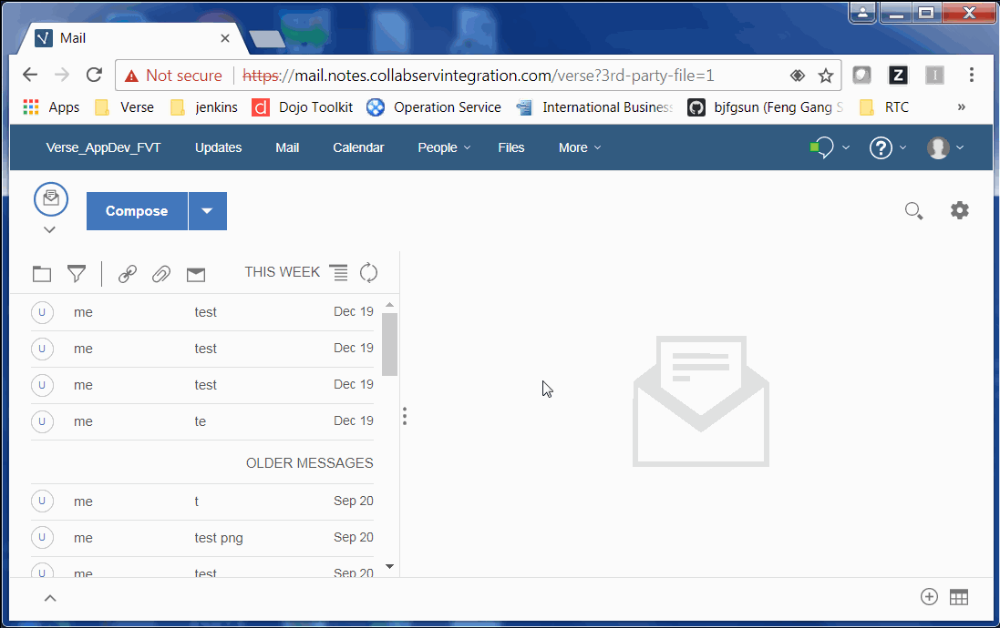

# Verse Files Extensibility POC Server

This project is used as the server of a POC for Verse Files Extensibility.

## Demo

Below is a demo of Files Extensibility.



## Design

- [UX design](https://apps.na.collabserv.com/files/app/file/81a85cc6-497c-40af-9a06-99c0847e7406)
- [Implementation Design]()

## Steps To Run The POC Locally

### Clone this server project and run it locally

1. Clone it into your local disk
2. use `npm install` to install all dependencies
3. use `npm start` to start the server

### Install Extension

You need to clone [verse-developer-chrome-ext](https://github.ibm.com/IBM-Verse/verse-developer-chrome-ext) and install it as a Chrome extension first. Then copy the `applications.json` from this project into the `src` folder of project `verse-developer-chrome-ext`. What's more, you also need to add a new match line in the array `content_scripts.matches` of file `manifest.json`. Like below:

```
  ...
  
  "content_scripts": [ {
    "js": [ "contentscript.js"],
    "matches": [
      "https://mail.notes.na.collabserv.com/verse*",
      "https://mail.notes.ap.collabserv.com/verse*",
      "https://mail.notes.ce.collabserv.com/verse*",
      "https://mail.notes.collabservintegration.com/vers*" // new added
    ],
    "run_at": "document_start"
  }],

  ...
```

For the new added line, it should match the Verse server URL that you are using.

In `chrome://extensions` page, reload above extension to make above updates work.

### Run the POC

1. In Chrome, start Verse with gk `extension=1&3rd-party-file=1`, e.g. `https://mail.notes.collabservintegration.com/verse?extension=1&3rd-party-file=1`
2. In Chrome, open a new tab with https://localhost:3002/, it will show you a blocker `Your connection is not private`. Click `ADVANCED` and then `Proceed to localhost (unsafe)`. This is only need to do for the first time after POC server started.
3. Compose a new message, then you can try the POC as the demo mentioned above.
